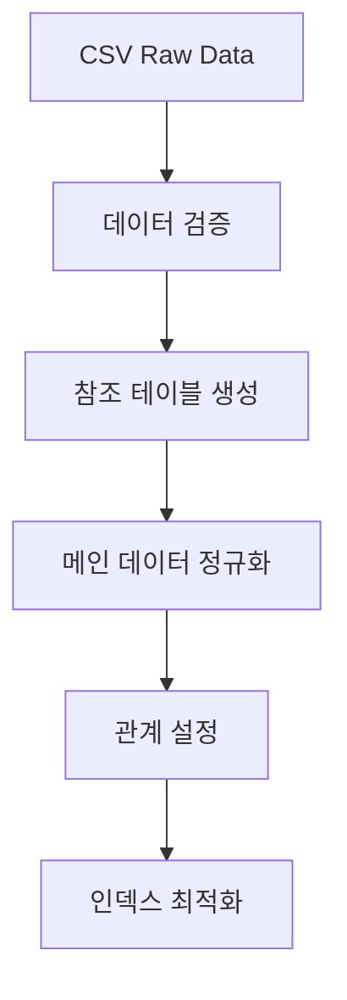

# 오클러 프로젝트 데이터 관리 계획서

**작성자**: 팀장킴(Project Manager) & 강디비(Database Optimizer)  
**작성일**: 2025-07-30  
**버전**: v1.0  

---

## 📋 프로젝트 개요

### 현재 상황 분석
- **데이터 규모**: 12,000개 업체 정보 (CSV 형식)
- **데이터 구성**: 업체명, 위치정보, 카테고리, 운영상태 등 23개 필드
- **활용 목적**: 오클러 앱에서 업체 검색 및 정보 제공
- **상태 정보**: 영업중/폐업/빈점포 상태 추적

### 프로젝트 목표
1. 안정적이고 확장 가능한 데이터베이스 구축
2. 실시간 업체 정보 업데이트 시스템 구현
3. 데이터 품질 보장 및 일관성 유지
4. 개발팀 친화적인 데이터 접근 방법 제공

---

## 1. 데이터 구조 분석 및 정규화 방안

### 1.1 현재 CSV 데이터 구조 분석

```csv
컬럼명: id, store_key, name, hotplace, address_a, address_b, address_c, 
        category_a, category_b, keywords_a, keywords_b, keywords_c, 
        map_link, open_date, close_date, status, concept, extra_link, 
        description, thumbnail, photos, parking, event
```

### 1.2 데이터 품질 이슈 분석

**🔍 팀장킴의 분석**:
- **중복 데이터**: store_key가 비어있는 경우 다수 발견
- **누락 데이터**: status 필드가 대부분 NULL
- **비정규화**: 주소 정보가 3개 컬럼으로 분산
- **일관성 부족**: 날짜 형식이 "2021-Q1" 형태로 비표준

**⚡ 강디비의 최적화 제안**:
```sql
-- 데이터 정규화를 위한 참조 테이블 구조
-- 1) 지역 정보 정규화
CREATE TABLE regions (
    id UUID PRIMARY KEY,
    hotplace_code VARCHAR(10) UNIQUE,
    name VARCHAR(50),
    district VARCHAR(50),
    full_name VARCHAR(100)
);

-- 2) 카테고리 계층 구조 정규화
CREATE TABLE categories (
    id UUID PRIMARY KEY,
    code VARCHAR(20) UNIQUE,
    name VARCHAR(100),
    parent_id UUID REFERENCES categories(id),
    level INTEGER CHECK (level IN (1, 2))
);

-- 3) 키워드 정규화 (다대다 관계)
CREATE TABLE business_keywords (
    business_id UUID REFERENCES businesses(id),
    keyword VARCHAR(100),
    keyword_type VARCHAR(20) CHECK (keyword_type IN ('primary', 'secondary', 'tertiary')),
    PRIMARY KEY (business_id, keyword)
);
```

### 1.3 정규화 전략



---

## 2. 데이터베이스 설계 (테이블 구조)

### 2.1 최적화된 스키마 구조

**🎯 팀장킴의 요구사항**:
- 빠른 검색 성능
- 확장 가능한 구조
- 개발팀 친화적 API

**⚡ 강디비의 성능 최적화 설계**:

```sql
-- 핵심 업체 테이블 (최적화된 구조)
CREATE TABLE businesses (
    id UUID DEFAULT gen_random_uuid() PRIMARY KEY,
    
    -- 기본 정보
    original_id VARCHAR(20) UNIQUE NOT NULL,
    store_key VARCHAR(50),
    name VARCHAR(200) NOT NULL,
    
    -- 위치 정보 (정규화)
    hotplace_id UUID REFERENCES hotplaces(id) NOT NULL,
    address_detail VARCHAR(200),
    latitude DECIMAL(10, 7),
    longitude DECIMAL(10, 7),
    
    -- 카테고리 (정규화)
    category_id UUID REFERENCES categories(id) NOT NULL,
    subcategory_id UUID REFERENCES subcategories(id),
    
    -- 검색 최적화 (GIN 인덱스용)
    keywords JSONB DEFAULT '[]'::jsonb,
    search_vector TSVECTOR GENERATED ALWAYS AS (
        to_tsvector('korean', 
            COALESCE(name, '') || ' ' || 
            COALESCE(array_to_string(ARRAY(SELECT jsonb_array_elements_text(keywords)), ' '), '')
        )
    ) STORED,
    
    -- 운영 상태 관리 (개선된 로직)
    status business_status DEFAULT 'active',  -- ENUM 타입
    open_date DATE,
    close_date DATE,
    last_verified_at TIMESTAMP WITH TIME ZONE,
    
    -- 미디어 및 부가 정보
    thumbnail TEXT,
    photos JSONB DEFAULT '[]'::jsonb,
    description TEXT,
    concept TEXT,
    
    -- 외부 링크
    map_link TEXT,
    website_url TEXT,
    
    -- 편의시설 (비트마스크 방식으로 최적화)
    amenities INTEGER DEFAULT 0,  -- 주차, 이벤트 등을 비트로 관리
    
    -- 분석 데이터
    view_count INTEGER DEFAULT 0,
    search_count INTEGER DEFAULT 0,
    favorite_count INTEGER DEFAULT 0,
    rating_avg DECIMAL(3,2) DEFAULT 0.0,
    
    -- 메타데이터
    data_source VARCHAR(50) DEFAULT 'csv_import',
    data_quality_score INTEGER DEFAULT 0,  -- 0-100 데이터 품질 점수
    raw_data JSONB,  -- 원본 데이터 보관
    
    created_at TIMESTAMP WITH TIME ZONE DEFAULT NOW(),
    updated_at TIMESTAMP WITH TIME ZONE DEFAULT NOW()
);

-- 업체 상태 ENUM 정의
CREATE TYPE business_status AS ENUM ('active', 'closed', 'temporary_closed', 'pending_verification');

-- 편의시설 비트마스크 상수
/*
편의시설 비트 정의:
BIT 0 (1): 주차 가능
BIT 1 (2): 이벤트 진행
BIT 2 (4): 배달 가능
BIT 3 (8): 포장 가능
BIT 4 (16): 예약 가능
BIT 5 (32): 카드 결제 가능
*/
```

### 2.2 고성능 인덱스 전략

```sql
-- 검색 성능 최적화 인덱스
CREATE INDEX CONCURRENTLY idx_businesses_search_gin 
ON businesses USING GIN(search_vector);

CREATE INDEX CONCURRENTLY idx_businesses_location_btree 
ON businesses(hotplace_id, category_id) WHERE status = 'active';

CREATE INDEX CONCURRENTLY idx_businesses_compound_search 
ON businesses(status, hotplace_id, category_id) 
INCLUDE (name, view_count);

-- 분석 쿼리 최적화
CREATE INDEX CONCURRENTLY idx_businesses_analytics 
ON businesses(created_at, status) 
WHERE data_quality_score > 50;

-- 지리적 검색 최적화 (향후 확장용)
CREATE INDEX CONCURRENTLY idx_businesses_geo 
ON businesses USING GIST(ST_Point(longitude, latitude));
```

### 2.3 파티셔닝 전략 (확장성 고려)

```sql
-- 분석 데이터 월별 파티셔닝
CREATE TABLE business_analytics (
    id UUID DEFAULT gen_random_uuid(),
    business_id UUID NOT NULL,
    event_type VARCHAR(50) NOT NULL,
    event_date DATE NOT NULL DEFAULT CURRENT_DATE,
    count INTEGER DEFAULT 1,
    metadata JSONB DEFAULT '{}'::jsonb,
    created_at TIMESTAMP WITH TIME ZONE DEFAULT NOW()
) PARTITION BY RANGE (event_date);

-- 월별 파티션 생성 예시
CREATE TABLE business_analytics_2025_07 PARTITION OF business_analytics
FOR VALUES FROM ('2025-07-01') TO ('2025-08-01');

CREATE TABLE business_analytics_2025_08 PARTITION OF business_analytics  
FOR VALUES FROM ('2025-08-01') TO ('2025-09-01');
```

---

## 3. 데이터 마이그레이션 계획 (엑셀 → DB)

### 3.1 마이그레이션 전략

**🎯 팀장킴의 프로젝트 관리 관점**:
1. **단계별 진행**: 테스트 → 스테이징 → 프로덕션
2. **백업 우선**: 원본 데이터 보존
3. **검증 필수**: 각 단계별 데이터 무결성 확인
4. **롤백 계획**: 문제 발생시 즉시 복구

### 3.2 마이그레이션 스크립트

```python
# migration_manager.py
import pandas as pd
import psycopg2
from psycopg2.extras import RealDictCursor
import uuid
import json
import logging
from datetime import datetime, date
import re

class DataMigrationManager:
    def __init__(self, db_config):
        self.db_config = db_config
        self.connection = None
        self.logger = self._setup_logger()
        
    def _setup_logger(self):
        logging.basicConfig(
            level=logging.INFO,
            format='%(asctime)s - %(levelname)s - %(message)s',
            handlers=[
                logging.FileHandler(f'migration_{datetime.now().strftime("%Y%m%d_%H%M%S")}.log'),
                logging.StreamHandler()
            ]
        )
        return logging.getLogger(__name__)
    
    def connect_db(self):
        """데이터베이스 연결"""
        try:
            self.connection = psycopg2.connect(**self.db_config)
            self.connection.autocommit = False
            self.logger.info("데이터베이스 연결 성공")
        except Exception as e:
            self.logger.error(f"데이터베이스 연결 실패: {e}")
            raise
    
    def load_csv_data(self, csv_path):
        """CSV 데이터 로드 및 전처리"""
        try:
            # CSV 로드 (인코딩 자동 감지)
            df = pd.read_csv(csv_path, encoding='utf-8-sig')
            self.logger.info(f"CSV 로드 완료: {len(df)} 행")
            
            # 데이터 전처리
            df = self._preprocess_data(df)
            
            return df
        except Exception as e:
            self.logger.error(f"CSV 로드 실패: {e}")
            raise
    
    def _preprocess_data(self, df):
        """데이터 전처리 및 품질 개선"""
        original_count = len(df)
        
        # 1. 필수 필드 검증
        df = df.dropna(subset=['id', 'name'])
        
        # 2. 날짜 형식 정규화 (2021-Q1 → 2021-01-01)
        df['open_date_parsed'] = df['open_date'].apply(self._parse_quarter_date)
        df['close_date_parsed'] = df['close_date'].apply(self._parse_quarter_date)
        
        # 3. 상태 정보 정규화
        df['status_normalized'] = df.apply(self._normalize_status, axis=1)
        
        # 4. 키워드 JSON 배열로 변환
        df['keywords_json'] = df.apply(self._combine_keywords, axis=1)
        
        # 5. 주소 정보 결합
        df['full_address'] = df['address_a'].fillna('') + ' ' + \
                           df['address_b'].fillna('') + ' ' + \
                           df['address_c'].fillna('')
        
        # 6. 데이터 품질 점수 계산
        df['quality_score'] = df.apply(self._calculate_quality_score, axis=1)
        
        cleaned_count = len(df)
        self.logger.info(f"데이터 전처리 완료: {original_count} → {cleaned_count} 행")
        
        return df
    
    def _parse_quarter_date(self, quarter_str):
        """분기 형식 날짜를 실제 날짜로 변환"""
        if pd.isna(quarter_str) or quarter_str == '-':
            return None
        
        pattern = r'(\d{4})-Q([1-4])'
        match = re.match(pattern, str(quarter_str))
        
        if match:
            year, quarter = match.groups()
            quarter_months = {'1': '01', '2': '04', '3': '07', '4': '10'}
            return f"{year}-{quarter_months[quarter]}-01"
        
        return None
    
    def _normalize_status(self, row):
        """업체 상태 정규화"""
        if pd.notna(row['close_date']) and row['close_date'] != '-':
            return 'closed'
        elif row['status'] == 'NULL' or pd.isna(row['status']):
            return 'active'  # 기본값
        else:
            return 'active'
    
    def _combine_keywords(self, row):
        """키워드를 JSON 배열로 결합"""
        keywords = []
        for col in ['keywords_a', 'keywords_b', 'keywords_c']:
            if pd.notna(row[col]) and row[col].strip():
                keywords.append(row[col].strip())
        return json.dumps(keywords, ensure_ascii=False)
    
    def _calculate_quality_score(self, row):
        """데이터 품질 점수 계산 (0-100)"""
        score = 0
        
        # 필수 필드 존재 (40점)
        if pd.notna(row['name']) and row['name'].strip():
            score += 20
        if pd.notna(row['hotplace']) and row['hotplace'].strip():
            score += 10
        if pd.notna(row['category_a']) and row['category_a'].strip():
            score += 10
        
        # 선택 필드 존재 (30점)
        if pd.notna(row['map_link']) and row['map_link'].strip():
            score += 15
        if pd.notna(row['description']) and row['description'].strip():
            score += 10
        if pd.notna(row['keywords_a']) and row['keywords_a'].strip():
            score += 5
        
        # 주소 정보 완성도 (20점)
        address_fields = ['address_a', 'address_b', 'address_c']
        filled_fields = sum(1 for field in address_fields 
                          if pd.notna(row[field]) and row[field].strip())
        score += (filled_fields / len(address_fields)) * 20
        
        # 날짜 정보 존재 (10점)
        if pd.notna(row['open_date']) and row['open_date'] != '-':
            score += 10
        
        return int(score)
    
    def create_reference_tables(self, df):
        """참조 테이블 생성 및 데이터 삽입"""
        cursor = self.connection.cursor(cursor_factory=RealDictCursor)
        
        try:
            # 1. 핫플레이스 테이블 생성
            hotplaces = df['hotplace'].dropna().unique()
            for hotplace in hotplaces:
                cursor.execute("""
                    INSERT INTO hotplaces (name, display_name, district)
                    VALUES (%s, %s, %s)
                    ON CONFLICT (name) DO NOTHING
                """, (hotplace, hotplace, hotplace))
            
            # 2. 카테고리 테이블 생성
            categories = df['category_a'].dropna().unique()
            for category in categories:
                cursor.execute("""
                    INSERT INTO categories (name, display_name)
                    VALUES (%s, %s)
                    ON CONFLICT (name) DO NOTHING
                """, (category, category))
            
            # 3. 서브카테고리 테이블 생성
            for _, row in df[['category_a', 'category_b']].dropna().drop_duplicates().iterrows():
                cursor.execute("""
                    INSERT INTO subcategories (category_id, name, display_name)
                    SELECT c.id, %s, %s
                    FROM categories c
                    WHERE c.name = %s
                    ON CONFLICT DO NOTHING
                """, (row['category_b'], row['category_b'], row['category_a']))
            
            self.connection.commit()
            self.logger.info("참조 테이블 생성 완료")
            
        except Exception as e:
            self.connection.rollback()
            self.logger.error(f"참조 테이블 생성 실패: {e}")
            raise
        finally:
            cursor.close()
    
    def migrate_businesses(self, df):
        """업체 데이터 마이그레이션"""
        cursor = self.connection.cursor(cursor_factory=RealDictCursor)
        
        success_count = 0
        error_count = 0
        
        try:
            for index, row in df.iterrows():
                try:
                    # 참조 ID 조회
                    hotplace_id = self._get_reference_id(cursor, 'hotplaces', 'name', row['hotplace'])
                    category_id = self._get_reference_id(cursor, 'categories', 'name', row['category_a'])
                    subcategory_id = None
                    if pd.notna(row['category_b']):
                        subcategory_id = self._get_subcategory_id(cursor, row['category_a'], row['category_b'])
                    
                    # 업체 데이터 삽입
                    cursor.execute("""
                        INSERT INTO businesses (
                            original_id, store_key, name, hotplace_id, category_id, subcategory_id,
                            address_detail, keywords, open_date, close_date, status,
                            map_link, description, concept, thumbnail, 
                            has_parking, has_event, data_quality_score, raw_data
                        ) VALUES (
                            %s, %s, %s, %s, %s, %s, %s, %s::jsonb, %s, %s, %s,
                            %s, %s, %s, %s, %s, %s, %s, %s::jsonb
                        )
                        ON CONFLICT (original_id) DO UPDATE SET
                            name = EXCLUDED.name,
                            updated_at = NOW()
                    """, (
                        row['id'], row['store_key'], row['name'], hotplace_id, 
                        category_id, subcategory_id, row['full_address'], 
                        row['keywords_json'], row['open_date_parsed'], 
                        row['close_date_parsed'], row['status_normalized'],
                        row['map_link'], row['description'], row['concept'], 
                        row['thumbnail'], 
                        bool(row['parking']) if pd.notna(row['parking']) else False,
                        bool(row['event']) if pd.notna(row['event']) else False,
                        row['quality_score'], json.dumps(row.to_dict(), default=str, ensure_ascii=False)
                    ))
                    
                    success_count += 1
                    
                    if success_count % 100 == 0:
                        self.connection.commit()
                        self.logger.info(f"진행 상황: {success_count}/{len(df)} 완료")
                
                except Exception as e:
                    error_count += 1
                    self.logger.error(f"행 {index} 마이그레이션 실패: {e}")
                    continue
            
            self.connection.commit()
            self.logger.info(f"마이그레이션 완료: 성공 {success_count}, 실패 {error_count}")
            
        except Exception as e:
            self.connection.rollback()
            self.logger.error(f"마이그레이션 실패: {e}")
            raise
        finally:
            cursor.close()
    
    def _get_reference_id(self, cursor, table, column, value):
        """참조 테이블 ID 조회"""
        cursor.execute(f"SELECT id FROM {table} WHERE {column} = %s", (value,))
        result = cursor.fetchone()
        return result['id'] if result else None
    
    def _get_subcategory_id(self, cursor, category_name, subcategory_name):
        """서브카테고리 ID 조회"""
        cursor.execute("""
            SELECT sc.id 
            FROM subcategories sc
            JOIN categories c ON sc.category_id = c.id
            WHERE c.name = %s AND sc.name = %s
        """, (category_name, subcategory_name))
        result = cursor.fetchone()
        return result['id'] if result else None
    
    def validate_migration(self):
        """마이그레이션 결과 검증"""
        cursor = self.connection.cursor(cursor_factory=RealDictCursor)
        
        try:
            # 1. 전체 데이터 수 확인
            cursor.execute("SELECT COUNT(*) as count FROM businesses")
            business_count = cursor.fetchone()['count']
            
            # 2. 데이터 품질 분포 확인
            cursor.execute("""
                SELECT 
                    AVG(data_quality_score) as avg_quality,
                    MIN(data_quality_score) as min_quality,
                    MAX(data_quality_score) as max_quality,
                    COUNT(CASE WHEN data_quality_score >= 80 THEN 1 END) as high_quality_count
                FROM businesses
            """)
            quality_stats = cursor.fetchone()
            
            # 3. 상태별 분포 확인
            cursor.execute("""
                SELECT status, COUNT(*) as count 
                FROM businesses 
                GROUP BY status
            """)
            status_stats = cursor.fetchall()
            
            # 4. 참조 무결성 확인
            cursor.execute("""
                SELECT COUNT(*) as orphaned_businesses
                FROM businesses b
                LEFT JOIN hotplaces h ON b.hotplace_id = h.id
                LEFT JOIN categories c ON b.category_id = c.id
                WHERE h.id IS NULL OR c.id IS NULL
            """)
            orphaned_count = cursor.fetchone()['orphaned_count']
            
            # 검증 결과 리포트
            report = {
                'total_businesses': business_count,
                'quality_stats': dict(quality_stats),
                'status_distribution': {row['status']: row['count'] for row in status_stats},
                'orphaned_records': orphaned_count,
                'validation_passed': orphaned_count == 0
            }
            
            self.logger.info("=== 마이그레이션 검증 결과 ===")
            self.logger.info(json.dumps(report, indent=2, ensure_ascii=False))
            
            return report
            
        except Exception as e:
            self.logger.error(f"검증 실패: {e}")
            raise
        finally:
            cursor.close()
    
    def close_connection(self):
        """데이터베이스 연결 종료"""
        if self.connection:
            self.connection.close()
            self.logger.info("데이터베이스 연결 종료")

# 실행 스크립트
if __name__ == "__main__":
    # 데이터베이스 설정
    DB_CONFIG = {
        'host': 'localhost',
        'database': 'ocler_db',
        'user': 'ocler_user',
        'password': 'secure_password',
        'port': 5432
    }
    
    # 마이그레이션 실행
    migrator = DataMigrationManager(DB_CONFIG)
    
    try:
        # 1. 데이터베이스 연결
        migrator.connect_db()
        
        # 2. CSV 데이터 로드
        df = migrator.load_csv_data('C:/dev/OCLER/raw data-list-cvs.csv')
        
        # 3. 참조 테이블 생성
        migrator.create_reference_tables(df)
        
        # 4. 업체 데이터 마이그레이션
        migrator.migrate_businesses(df)
        
        # 5. 마이그레이션 검증
        validation_result = migrator.validate_migration()
        
        if validation_result['validation_passed']:
            print("✅ 마이그레이션이 성공적으로 완료되었습니다!")
        else:
            print("⚠️ 마이그레이션 완료되었으나 검증 중 문제가 발견되었습니다.")
            
    except Exception as e:
        print(f"❌ 마이그레이션 실패: {e}")
    finally:
        migrator.close_connection()
```

### 3.3 배치 처리 최적화

```python
# batch_processor.py
class BatchProcessor:
    def __init__(self, batch_size=1000):
        self.batch_size = batch_size
    
    def process_in_batches(self, data, process_func):
        """대용량 데이터를 배치 단위로 처리"""
        total_batches = len(data) // self.batch_size + 1
        
        for i in range(0, len(data), self.batch_size):
            batch = data[i:i + self.batch_size]
            batch_num = (i // self.batch_size) + 1
            
            print(f"배치 {batch_num}/{total_batches} 처리 중...")
            
            try:
                process_func(batch)
            except Exception as e:
                print(f"배치 {batch_num} 처리 실패: {e}")
                # 실패한 배치를 개별 처리로 재시도
                for item in batch:
                    try:
                        process_func([item])
                    except:
                        continue
```

---

## 4. 데이터 품질 관리 및 검증 방법

### 4.1 데이터 품질 관리 프레임워크

**🎯 팀장킴의 품질 관리 전략**:
1. **자동화된 검증**: 데이터 입력시 실시간 검증
2. **정기적 감사**: 주기적 데이터 품질 점검
3. **이상 탐지**: 비정상적인 데이터 패턴 감지
4. **품질 점수**: 각 레코드별 품질 지표 관리

```python
# data_quality_manager.py
import pandas as pd
import numpy as np
from datetime import datetime, timedelta
import re
from typing import Dict, List, Tuple

class DataQualityManager:
    def __init__(self, db_connection):
        self.db = db_connection
        self.quality_rules = self._initialize_quality_rules()
        
    def _initialize_quality_rules(self):
        """데이터 품질 규칙 정의"""
        return {
            'completeness': {
                'required_fields': ['name', 'hotplace', 'category_a'],
                'recommended_fields': ['map_link', 'description', 'keywords_a'],
                'weight': 0.4
            },
            'validity': {
                'name_pattern': r'^[\w\s\-\.가-힣]+$',
                'url_pattern': r'^https?://.*',
                'date_pattern': r'^\d{4}-\d{2}-\d{2}$',
                'weight': 0.3
            },
            'consistency': {
                'status_close_date_match': True,
                'category_subcategory_match': True,
                'weight': 0.2
            },
            'accuracy': {
                'duplicate_detection': True,
                'business_name_similarity': 0.85,
                'weight': 0.1
            }
        }
    
    def calculate_quality_score(self, business_data: Dict) -> Dict:
        """업체 데이터의 품질 점수 계산"""
        scores = {}
        
        # 1. 완성도 점수
        scores['completeness'] = self._check_completeness(business_data)
        
        # 2. 유효성 점수
        scores['validity'] = self._check_validity(business_data)
        
        # 3. 일관성 점수
        scores['consistency'] = self._check_consistency(business_data)
        
        # 4. 정확성 점수
        scores['accuracy'] = self._check_accuracy(business_data)
        
        # 가중 평균 계산
        total_score = sum(
            scores[category] * self.quality_rules[category]['weight']
            for category in scores
        )
        
        return {
            'total_score': round(total_score, 2),
            'category_scores': scores,
            'recommendations': self._generate_recommendations(scores)
        }
    
    def _check_completeness(self, data: Dict) -> float:
        """데이터 완성도 검사"""
        required_score = 0
        required_fields = self.quality_rules['completeness']['required_fields']
        
        for field in required_fields:
            if data.get(field) and str(data[field]).strip():
                required_score += 1
        
        required_ratio = required_score / len(required_fields)
        
        # 권장 필드 검사
        recommended_score = 0
        recommended_fields = self.quality_rules['completeness']['recommended_fields']
        
        for field in recommended_fields:
            if data.get(field) and str(data[field]).strip():
                recommended_score += 1
        
        recommended_ratio = recommended_score / len(recommended_fields)
        
        # 필수 70%, 권장 30% 비중
        return (required_ratio * 0.7 + recommended_ratio * 0.3) * 100
    
    def _check_validity(self, data: Dict) -> float:
        """데이터 유효성 검사"""
        validity_checks = [
            self._validate_name(data.get('name')),
            self._validate_url(data.get('map_link')),
            self._validate_date(data.get('open_date')),
            self._validate_date(data.get('close_date')),
            self._validate_status(data.get('status'))
        ]
        
        valid_count = sum(1 for check in validity_checks if check)
        return (valid_count / len(validity_checks)) * 100
    
    def _check_consistency(self, data: Dict) -> float:
        """데이터 일관성 검사"""
        consistency_score = 100
        
        # 폐업 상태와 폐업일 일치성
        if data.get('status') == 'closed' and not data.get('close_date'):
            consistency_score -= 30
        
        if data.get('close_date') and data.get('status') != 'closed':
            consistency_score -= 30
        
        # 카테고리-서브카테고리 일치성
        if not self._validate_category_subcategory_match(
            data.get('category_a'), data.get('category_b')
        ):
            consistency_score -= 40
        
        return max(0, consistency_score)
    
    def _check_accuracy(self, data: Dict) -> float:
        """데이터 정확성 검사"""
        accuracy_score = 100
        
        # 중복 업체 검사
        if self._check_duplicate_business(data):
            accuracy_score -= 50
        
        # 주소 정확성 검사
        if not self._validate_address_format(data):
            accuracy_score -= 30
        
        # 외부 링크 접근성 검사 (비동기 처리 필요)
        if data.get('map_link') and not self._check_url_accessibility(data['map_link']):
            accuracy_score -= 20
        
        return max(0, accuracy_score)
    
    def _validate_name(self, name: str) -> bool:
        """업체명 유효성 검사"""
        if not name:
            return False
        return len(name.strip()) >= 2 and len(name) <= 100
    
    def _validate_url(self, url: str) -> bool:
        """URL 유효성 검사"""
        if not url:
            return True  # 선택 필드이므로 없어도 유효
        pattern = self.quality_rules['validity']['url_pattern']
        return bool(re.match(pattern, url))
    
    def _validate_date(self, date_str: str) -> bool:
        """날짜 형식 유효성 검사"""
        if not date_str:
            return True  # 선택 필드
        try:
            datetime.strptime(date_str, '%Y-%m-%d')
            return True
        except ValueError:
            return False
    
    def _validate_status(self, status: str) -> bool:
        """상태 값 유효성 검사"""
        valid_statuses = ['active', 'closed', 'temporary_closed', 'pending_verification']
        return status in valid_statuses
    
    def _validate_category_subcategory_match(self, category: str, subcategory: str) -> bool:
        """카테고리-서브카테고리 매칭 검사"""
        if not category or not subcategory:
            return True
        
        # DB에서 유효한 조합인지 확인
        cursor = self.db.cursor()
        cursor.execute("""
            SELECT 1 FROM subcategories sc
            JOIN categories c ON sc.category_id = c.id
            WHERE c.name = %s AND sc.name = %s
        """, (category, subcategory))
        
        return cursor.fetchone() is not None
    
    def _check_duplicate_business(self, data: Dict) -> bool:
        """중복 업체 검사"""
        cursor = self.db.cursor()
        cursor.execute("""
            SELECT COUNT(*) as count FROM businesses
            WHERE name = %s AND hotplace_id = (
                SELECT id FROM hotplaces WHERE name = %s
            ) AND id != %s
        """, (data.get('name'), data.get('hotplace'), data.get('id', '')))
        
        result = cursor.fetchone()
        return result['count'] > 0
    
    def _validate_address_format(self, data: Dict) -> bool:
        """주소 형식 검사"""
        address_parts = [
            data.get('address_a'),
            data.get('address_b'), 
            data.get('address_c')
        ]
        
        # 최소 2개 이상의 주소 구성요소가 있어야 함
        filled_parts = [part for part in address_parts if part and part.strip()]
        return len(filled_parts) >= 2
    
    def _check_url_accessibility(self, url: str) -> bool:
        """URL 접근 가능성 검사 (간단한 형태)"""
        try:
            import requests
            response = requests.head(url, timeout=5)
            return response.status_code < 400
        except:
            return False
    
    def _generate_recommendations(self, scores: Dict) -> List[str]:
        """품질 개선 권장사항 생성"""
        recommendations = []
        
        if scores['completeness'] < 80:
            recommendations.append("필수 정보(업체명, 위치, 카테고리)를 모두 입력해주세요.")
        
        if scores['validity'] < 70:
            recommendations.append("입력된 정보의 형식을 확인해주세요. (URL, 날짜 형식 등)")
        
        if scores['consistency'] < 80:
            recommendations.append("업체 상태와 관련 정보(폐업일 등)의 일관성을 확인해주세요.")
        
        if scores['accuracy'] < 70:
            recommendations.append("중복 업체가 없는지, 주소 정보가 정확한지 확인해주세요.")
        
        return recommendations

    def run_quality_audit(self) -> Dict:
        """전체 데이터 품질 감사 실행"""
        cursor = self.db.cursor()
        
        # 전체 업체 데이터 조회
        cursor.execute("""
            SELECT b.*, h.name as hotplace_name, c.name as category_name
            FROM businesses b
            LEFT JOIN hotplaces h ON b.hotplace_id = h.id
            LEFT JOIN categories c ON b.category_id = c.id
        """)
        
        businesses = cursor.fetchall()
        
        audit_results = {
            'total_businesses': len(businesses),
            'quality_distribution': {'high': 0, 'medium': 0, 'low': 0},
            'common_issues': {},
            'recommendations': []
        }
        
        for business in businesses:
            quality_result = self.calculate_quality_score(dict(business))
            score = quality_result['total_score']
            
            # 품질 등급 분류
            if score >= 80:
                audit_results['quality_distribution']['high'] += 1
            elif score >= 60:
                audit_results['quality_distribution']['medium'] += 1
            else:
                audit_results['quality_distribution']['low'] += 1
        
        return audit_results

# 사용 예시
quality_manager = DataQualityManager(db_connection)

# 개별 업체 품질 점수 계산
business_data = {
    'name': '서면맛집',
    'hotplace': '서면',
    'category_a': '식사술',
    'category_b': '한식.분식',
    'map_link': 'http://naver.me/example',
    'status': 'active'
}

quality_result = quality_manager.calculate_quality_score(business_data)
print(f"품질 점수: {quality_result['total_score']}/100")
print(f"개선 권장사항: {quality_result['recommendations']}")
```

### 4.2 실시간 데이터 검증 시스템

```sql
-- 데이터 검증 트리거
CREATE OR REPLACE FUNCTION validate_business_data()
RETURNS TRIGGER AS $$
BEGIN
    -- 1. 필수 필드 검증
    IF NEW.name IS NULL OR LENGTH(TRIM(NEW.name)) < 2 THEN
        RAISE EXCEPTION '업체명은 2글자 이상이어야 합니다.';
    END IF;
    
    -- 2. 상태-날짜 일관성 검증
    IF NEW.status = 'closed' AND NEW.close_date IS NULL THEN
        RAISE EXCEPTION '폐업 상태인 경우 폐업일을 입력해야 합니다.';
    END IF;
    
    -- 3. 날짜 논리 검증
    IF NEW.open_date IS NOT NULL AND NEW.close_date IS NOT NULL 
       AND NEW.open_date > NEW.close_date THEN
        RAISE EXCEPTION '개업일이 폐업일보다 늦을 수 없습니다.';
    END IF;
    
    -- 4. 데이터 품질 점수 자동 계산
    NEW.data_quality_score = calculate_business_quality_score(NEW);
    
    RETURN NEW;
END;
$$ LANGUAGE plpgsql;

CREATE TRIGGER business_validation_trigger
    BEFORE INSERT OR UPDATE ON businesses
    FOR EACH ROW
    EXECUTE FUNCTION validate_business_data();

-- 품질 점수 계산 함수
CREATE OR REPLACE FUNCTION calculate_business_quality_score(business businesses)
RETURNS INTEGER AS $$
DECLARE
    score INTEGER := 0;
BEGIN
    -- 필수 정보 완성도 (40점)
    IF business.name IS NOT NULL AND LENGTH(TRIM(business.name)) >= 2 THEN
        score := score + 20;
    END IF;
    
    IF business.hotplace_id IS NOT NULL THEN
        score := score + 10;
    END IF;
    
    IF business.category_id IS NOT NULL THEN
        score := score + 10;
    END IF;
    
    -- 추가 정보 완성도 (30점)
    IF business.map_link IS NOT NULL AND business.map_link != '' THEN
        score := score + 15;
    END IF;
    
    IF business.description IS NOT NULL AND LENGTH(business.description) > 10 THEN
        score := score + 10;
    END IF;
    
    IF jsonb_array_length(business.keywords) > 0 THEN
        score := score + 5;
    END IF;
    
    -- 주소 정보 완성도 (20점)
    IF business.address_detail IS NOT NULL AND LENGTH(business.address_detail) > 10 THEN
        score := score + 20;
    END IF;
    
    -- 운영 정보 완성도 (10점)
    IF business.open_date IS NOT NULL THEN
        score := score + 10;
    END IF;
    
    RETURN score;
END;
$$ LANGUAGE plpgsql;
```

---

## 5. 백업 및 보안 전략

### 5.1 백업 전략

**🎯 팀장킴의 백업 관리 방침**:
1. **3-2-1 원칙**: 3개 복사본, 2개 다른 미디어, 1개 원격 저장
2. **자동화**: 수동 개입 최소화
3. **복구 테스트**: 정기적 복구 시나리오 테스트
4. **문서화**: 모든 백업 절차 문서화

```bash
#!/bin/bash
# backup_manager.sh

# 백업 설정
DB_NAME="ocler_db"
DB_USER="ocler_user" 
BACKUP_DIR="/backup/ocler"
REMOTE_BACKUP_DIR="s3://ocler-backup-bucket"
RETENTION_DAYS=30

# 로그 설정
LOG_FILE="/var/log/ocler_backup.log"
DATE=$(date '+%Y%m%d_%H%M%S')

log_message() {
    echo "[$(date '+%Y-%m-%d %H:%M:%S')] $1" | tee -a $LOG_FILE
}

# 데이터베이스 백업 함수
backup_database() {
    local backup_file="${BACKUP_DIR}/db_backup_${DATE}.sql"
    local compressed_file="${backup_file}.gz"
    
    log_message "데이터베이스 백업 시작: $DB_NAME"
    
    # PostgreSQL 덤프 생성
    pg_dump -h localhost -U $DB_USER -d $DB_NAME \
            --verbose --clean --no-owner --no-privileges \
            --file=$backup_file
    
    if [ $? -eq 0 ]; then
        # 압축
        gzip $backup_file
        log_message "데이터베이스 백업 완료: $compressed_file"
        
        # 원격 저장소에 업로드
        aws s3 cp $compressed_file $REMOTE_BACKUP_DIR/
        if [ $? -eq 0 ]; then
            log_message "원격 백업 업로드 완료"
        else
            log_message "ERROR: 원격 백업 업로드 실패"
        fi
    else
        log_message "ERROR: 데이터베이스 백업 실패"
        exit 1
    fi
}

# CSV 원본 데이터 백업
backup_csv_data() {
    local csv_backup_dir="${BACKUP_DIR}/csv_${DATE}"
    mkdir -p $csv_backup_dir
    
    log_message "CSV 데이터 백업 시작"
    
    # CSV 파일들 복사
    cp /data/csv/*.csv $csv_backup_dir/
    
    # 압축 아카이브 생성
    tar -czf "${csv_backup_dir}.tar.gz" -C $BACKUP_DIR "csv_${DATE}"
    rm -rf $csv_backup_dir
    
    # 원격 저장소 업로드
    aws s3 cp "${csv_backup_dir}.tar.gz" $REMOTE_BACKUP_DIR/
    
    log_message "CSV 데이터 백업 완료"
}

# 애플리케이션 설정 백업
backup_app_config() {
    local config_backup_file="${BACKUP_DIR}/app_config_${DATE}.tar.gz"
    
    log_message "애플리케이션 설정 백업 시작"
    
    tar -czf $config_backup_file \
        /app/config/ \
        /app/.env \
        /etc/nginx/sites-available/ocler \
        /etc/systemd/system/ocler.service
    
    aws s3 cp $config_backup_file $REMOTE_BACKUP_DIR/
    
    log_message "애플리케이션 설정 백업 완료"
}

# 오래된 백업 정리
cleanup_old_backups() {
    log_message "오래된 백업 파일 정리 시작 (${RETENTION_DAYS}일 이상)"
    
    # 로컬 백업 정리
    find $BACKUP_DIR -name "*.sql.gz" -mtime +$RETENTION_DAYS -delete
    find $BACKUP_DIR -name "*.tar.gz" -mtime +$RETENTION_DAYS -delete
    
    # S3 백업 정리 (lifecycle policy로 대체 가능)
    aws s3 ls $REMOTE_BACKUP_DIR/ | while read -r line; do
        file_date=$(echo $line | awk '{print $1}')
        file_name=$(echo $line | awk '{print $4}')
        
        if [[ $(date -d "$file_date" +%s) -lt $(date -d "$RETENTION_DAYS days ago" +%s) ]]; then
            aws s3 rm "${REMOTE_BACKUP_DIR}/${file_name}"
            log_message "오래된 원격 백업 삭제: $file_name"
        fi
    done
    
    log_message "백업 정리 완료"
}

# 백업 검증
verify_backup() {
    local backup_file="${BACKUP_DIR}/db_backup_${DATE}.sql.gz"
    
    if [ -f "$backup_file" ]; then
        # 압축 파일 무결성 검사
        if gzip -t "$backup_file"; then
            log_message "백업 파일 무결성 검증 성공"
            
            # 백업 파일 크기 확인 (최소 크기 체크)
            file_size=$(stat -c%s "$backup_file")
            min_size=1048576  # 1MB
            
            if [ $file_size -gt $min_size ]; then
                log_message "백업 파일 크기 검증 성공: ${file_size} bytes"
            else
                log_message "WARNING: 백업 파일 크기가 예상보다 작습니다: ${file_size} bytes"
            fi
        else
            log_message "ERROR: 백업 파일 손상 감지"
            exit 1
        fi
    else
        log_message "ERROR: 백업 파일을 찾을 수 없습니다"
        exit 1
    fi
}

# 메인 실행
main() {
    log_message "=== 오클러 백업 프로세스 시작 ==="
    
    # 백업 디렉토리 생성
    mkdir -p $BACKUP_DIR
    
    # 백업 실행
    backup_database
    backup_csv_data
    backup_app_config
    
    # 백업 검증
    verify_backup
    
    # 정리 작업
    cleanup_old_backups
    
    # 백업 완료 알림
    log_message "=== 백업 프로세스 완료 ==="
    
    # Slack 알림 (선택사항)
    if [ ! -z "$SLACK_WEBHOOK_URL" ]; then
        curl -X POST -H 'Content-type: application/json' \
            --data "{\"text\":\"✅ 오클러 DB 백업 완료: $(date)\"}" \
            $SLACK_WEBHOOK_URL
    fi
}

# 스크립트 실행
main "$@"
```

### 5.2 보안 전략

```python
# security_manager.py
import hashlib
import secrets
import jwt
from datetime import datetime, timedelta
from cryptography.fernet import Fernet
import bcrypt

class SecurityManager:
    def __init__(self, secret_key: str):
        self.secret_key = secret_key
        self.fernet = Fernet(Fernet.generate_key())
        
    def hash_password(self, password: str) -> str:
        """비밀번호 해싱"""
        salt = bcrypt.gensalt()
        hashed = bcrypt.hashpw(password.encode('utf-8'), salt)
        return hashed.decode('utf-8')
    
    def verify_password(self, password: str, hashed: str) -> bool:
        """비밀번호 검증"""
        return bcrypt.checkpw(password.encode('utf-8'), hashed.encode('utf-8'))
    
    def generate_api_key(self, user_id: str) -> str:
        """API 키 생성"""
        timestamp = str(int(datetime.now().timestamp()))
        raw_key = f"{user_id}:{timestamp}:{secrets.token_hex(16)}"
        return hashlib.sha256(raw_key.encode()).hexdigest()
    
    def encrypt_sensitive_data(self, data: str) -> str:
        """민감한 데이터 암호화"""
        return self.fernet.encrypt(data.encode()).decode()
    
    def decrypt_sensitive_data(self, encrypted_data: str) -> str:
        """암호화된 데이터 복호화"""
        return self.fernet.decrypt(encrypted_data.encode()).decode()
    
    def generate_jwt_token(self, user_id: str, role: str) -> str:
        """JWT 토큰 생성"""
        payload = {
            'user_id': user_id,
            'role': role,
            'exp': datetime.utcnow() + timedelta(hours=24),
            'iat': datetime.utcnow()
        }
        return jwt.encode(payload, self.secret_key, algorithm='HS256')
    
    def verify_jwt_token(self, token: str) -> dict:
        """JWT 토큰 검증"""
        try:
            payload = jwt.decode(token, self.secret_key, algorithms=['HS256'])
            return payload
        except jwt.ExpiredSignatureError:
            raise Exception("토큰이 만료되었습니다")
        except jwt.InvalidTokenError:
            raise Exception("유효하지 않은 토큰입니다")

# 데이터베이스 보안 설정
class DatabaseSecurity:
    @staticmethod
    def setup_row_level_security():
        """행 수준 보안 설정"""
        return """
        -- 사용자별 데이터 접근 제한
        ALTER TABLE businesses ENABLE ROW LEVEL SECURITY;
        
        -- 일반 사용자는 활성 업체만 조회 가능
        CREATE POLICY "public_businesses_select" ON businesses
        FOR SELECT TO authenticated
        USING (status = 'active');
        
        -- 업체 소유자는 자신의 업체 정보 수정 가능
        CREATE POLICY "owner_businesses_update" ON businesses
        FOR UPDATE TO authenticated
        USING (
            EXISTS (
                SELECT 1 FROM user_profiles 
                WHERE id = auth.uid() 
                AND owned_business_id = businesses.id
            )
        );
        
        -- 관리자는 모든 데이터 접근 가능
        CREATE POLICY "admin_businesses_all" ON businesses
        FOR ALL TO authenticated
        USING (
            EXISTS (
                SELECT 1 FROM user_profiles 
                WHERE id = auth.uid() 
                AND role = 'admin'
            )
        );
        """
    
    @staticmethod
    def setup_audit_logging():
        """감사 로그 설정"""
        return """
        -- 감사 로그 테이블
        CREATE TABLE audit_logs (
            id UUID DEFAULT gen_random_uuid() PRIMARY KEY,
            table_name VARCHAR(50) NOT NULL,
            record_id UUID,
            action VARCHAR(10) NOT NULL, -- INSERT, UPDATE, DELETE
            old_values JSONB,
            new_values JSONB,
            user_id UUID,
            ip_address INET,
            user_agent TEXT,
            created_at TIMESTAMP WITH TIME ZONE DEFAULT NOW()
        );
        
        -- 감사 로그 트리거 함수
        CREATE OR REPLACE FUNCTION audit_trigger_function()
        RETURNS TRIGGER AS $$
        BEGIN
            INSERT INTO audit_logs (
                table_name, record_id, action, old_values, new_values, 
                user_id, ip_address
            ) VALUES (
                TG_TABLE_NAME,
                COALESCE(NEW.id, OLD.id),
                TG_OP,
                CASE WHEN TG_OP = 'DELETE' THEN row_to_json(OLD) ELSE NULL END,
                CASE WHEN TG_OP IN ('INSERT', 'UPDATE') THEN row_to_json(NEW) ELSE NULL END,
                auth.uid(),
                inet_client_addr()
            );
            
            RETURN COALESCE(NEW, OLD);
        END;
        $$ LANGUAGE plpgsql;
        
        -- 업체 테이블에 감사 트리거 적용
        CREATE TRIGGER businesses_audit_trigger
            AFTER INSERT OR UPDATE OR DELETE ON businesses
            FOR EACH ROW EXECUTE FUNCTION audit_trigger_function();
        """
```

---

## 6. 데이터 업데이트 프로세스

### 6.1 실시간 업데이트 시스템

**🎯 팀장킴의 업데이트 관리 전략**:
1. **버저닝**: 모든 데이터 변경 이력 추적
2. **승인 프로세스**: 중요 변경사항 검토 단계
3. **롤백 시스템**: 문제 발생시 즉시 복구
4. **알림 시스템**: 이해관계자 자동 알림

```python
# update_manager.py
from enum import Enum
from typing import Dict, List, Optional
import json
from datetime import datetime

class UpdateType(Enum):
    CREATE = "create"
    UPDATE = "update" 
    DELETE = "delete"
    BULK_UPDATE = "bulk_update"

class UpdateStatus(Enum):
    PENDING = "pending"
    APPROVED = "approved"
    REJECTED = "rejected"
    APPLIED = "applied"
    FAILED = "failed"

class DataUpdateManager:
    def __init__(self, db_connection, notification_service):
        self.db = db_connection
        self.notifications = notification_service
        
    def create_update_request(self, 
                            requester_id: str,
                            update_type: UpdateType,
                            table_name: str,
                            record_id: Optional[str],
                            changes: Dict,
                            reason: str) -> str:
        """업데이트 요청 생성"""
        
        cursor = self.db.cursor()
        
        # 업데이트 요청 레코드 생성
        request_data = {
            'id': str(uuid.uuid4()),
            'requester_id': requester_id,
            'update_type': update_type.value,
            'table_name': table_name,
            'record_id': record_id,
            'changes': json.dumps(changes, ensure_ascii=False),
            'reason': reason,
            'status': UpdateStatus.PENDING.value,
            'created_at': datetime.now()
        }
        
        cursor.execute("""
            INSERT INTO update_requests (
                id, requester_id, update_type, table_name, record_id,
                changes, reason, status, created_at
            ) VALUES (
                %(id)s, %(requester_id)s, %(update_type)s, %(table_name)s, 
                %(record_id)s, %(changes)s, %(reason)s, %(status)s, %(created_at)s
            )
        """, request_data)
        
        self.db.commit()
        
        # 승인자에게 알림 발송
        self._notify_approvers(request_data['id'], update_type, table_name)
        
        return request_data['id']
    
    def approve_update_request(self, request_id: str, approver_id: str) -> bool:
        """업데이트 요청 승인"""
        cursor = self.db.cursor()
        
        # 요청 정보 조회
        cursor.execute("""
            SELECT * FROM update_requests 
            WHERE id = %s AND status = %s
        """, (request_id, UpdateStatus.PENDING.value))
        
        request = cursor.fetchone()
        if not request:
            return False
        
        try:
            # 변경사항 적용
            self._apply_changes(request)
            
            # 요청 상태 업데이트
            cursor.execute("""
                UPDATE update_requests 
                SET status = %s, approver_id = %s, approved_at = NOW()
                WHERE id = %s
            """, (UpdateStatus.APPLIED.value, approver_id, request_id))
            
            self.db.commit()
            
            # 요청자에게 승인 알림
            self._notify_requester(request['requester_id'], request_id, 'approved')
            
            return True
            
        except Exception as e:
            # 실패시 상태 업데이트
            cursor.execute("""
                UPDATE update_requests 
                SET status = %s, error_message = %s
                WHERE id = %s
            """, (UpdateStatus.FAILED.value, str(e), request_id))
            
            self.db.rollback()
            return False
    
    def _apply_changes(self, request: Dict):
        """변경사항 실제 적용"""
        cursor = self.db.cursor()
        changes = json.loads(request['changes'])
        
        if request['update_type'] == UpdateType.CREATE.value:
            # 새 레코드 생성
            self._create_record(cursor, request['table_name'], changes)
            
        elif request['update_type'] == UpdateType.UPDATE.value:
            # 기존 레코드 업데이트
            self._update_record(cursor, request['table_name'], 
                              request['record_id'], changes)
            
        elif request['update_type'] == UpdateType.DELETE.value:
            # 레코드 삭제 (소프트 삭제)
            cursor.execute(f"""
                UPDATE {request['table_name']} 
                SET status = 'deleted', updated_at = NOW()
                WHERE id = %s
            """, (request['record_id'],))
            
        elif request['update_type'] == UpdateType.BULK_UPDATE.value:
            # 대량 업데이트
            self._bulk_update_records(cursor, request['table_name'], changes)
    
    def _create_record(self, cursor, table_name: str, data: Dict):
        """새 레코드 생성"""
        columns = ', '.join(data.keys())
        placeholders = ', '.join(['%s'] * len(data))
        values = list(data.values())
        
        cursor.execute(f"""
            INSERT INTO {table_name} ({columns})
            VALUES ({placeholders})
        """, values)
    
    def _update_record(self, cursor, table_name: str, record_id: str, changes: Dict):
        """기존 레코드 업데이트"""
        set_clause = ', '.join([f"{key} = %s" for key in changes.keys()])
        values = list(changes.values()) + [record_id]
        
        cursor.execute(f"""
            UPDATE {table_name} 
            SET {set_clause}, updated_at = NOW()
            WHERE id = %s
        """, values)
    
    def _bulk_update_records(self, cursor, table_name: str, bulk_changes: Dict):
        """대량 레코드 업데이트"""
        # 조건과 변경사항에 따라 구현
        conditions = bulk_changes.get('conditions', {})
        updates = bulk_changes.get('updates', {})
        
        where_clause = ' AND '.join([f"{key} = %s" for key in conditions.keys()])
        set_clause = ', '.join([f"{key} = %s" for key in updates.keys()])
        
        values = list(updates.values()) + list(conditions.values())
        
        cursor.execute(f"""
            UPDATE {table_name}
            SET {set_clause}, updated_at = NOW()
            WHERE {where_clause}
        """, values)
    
    def get_update_history(self, table_name: str, record_id: str) -> List[Dict]:
        """레코드 업데이트 이력 조회"""
        cursor = self.db.cursor()
        
        cursor.execute("""
            SELECT ur.*, up.name as requester_name, ap.name as approver_name
            FROM update_requests ur
            LEFT JOIN user_profiles up ON ur.requester_id = up.id
            LEFT JOIN user_profiles ap ON ur.approver_id = ap.id
            WHERE ur.table_name = %s AND ur.record_id = %s
            ORDER BY ur.created_at DESC
        """, (table_name, record_id))
        
        return [dict(row) for row in cursor.fetchall()]
    
    def _notify_approvers(self, request_id: str, update_type: UpdateType, table_name: str):
        """승인자에게 알림 발송"""
        message = f"새로운 데이터 업데이트 요청: {table_name} {update_type.value}"
        self.notifications.send_to_admins(message, {'request_id': request_id})
    
    def _notify_requester(self, requester_id: str, request_id: str, status: str):
        """요청자에게 알림 발송"""
        message = f"데이터 업데이트 요청이 {status}되었습니다."
        self.notifications.send_to_user(requester_id, message, {'request_id': request_id})

# 자동 업데이트 스케줄러
class AutoUpdateScheduler:
    def __init__(self, db_connection):
        self.db = db_connection
        
    def schedule_csv_sync(self):
        """CSV 파일과 DB 동기화 스케줄"""
        # 매일 새벽 3시에 실행
        import schedule
        
        schedule.every().day.at("03:00").do(self.sync_csv_to_db)
        
    def sync_csv_to_db(self):
        """CSV 파일의 변경사항을 DB에 반영"""
        try:
            # 1. CSV 파일 로드
            new_data = pd.read_csv('/data/updated_businesses.csv')
            
            # 2. 변경사항 감지
            changes = self._detect_changes(new_data)
            
            # 3. 변경사항 적용
            for change in changes:
                self._apply_auto_update(change)
                
            logger.info(f"자동 동기화 완료: {len(changes)}개 변경사항 적용")
            
        except Exception as e:
            logger.error(f"자동 동기화 실패: {e}")
    
    def _detect_changes(self, new_data: pd.DataFrame) -> List[Dict]:
        """DB와 CSV 데이터 비교하여 변경사항 감지"""
        cursor = self.db.cursor()
        
        # 현재 DB 데이터 조회
        cursor.execute("SELECT * FROM businesses")
        current_data = pd.DataFrame(cursor.fetchall())
        
        changes = []
        
        # 신규 업체 감지
        new_ids = set(new_data['id']) - set(current_data['original_id'])
        for new_id in new_ids:
            new_record = new_data[new_data['id'] == new_id].iloc[0]
            changes.append({
                'type': 'create',
                'data': new_record.to_dict()
            })
        
        # 업데이트된 업체 감지
        common_ids = set(new_data['id']) & set(current_data['original_id'])
        for common_id in common_ids:
            new_record = new_data[new_data['id'] == common_id].iloc[0]
            current_record = current_data[current_data['original_id'] == common_id].iloc[0]
            
            # 필드별 비교
            changed_fields = {}
            for field in new_record.index:
                if field in current_record.index:
                    if new_record[field] != current_record[field]:
                        changed_fields[field] = new_record[field]
            
            if changed_fields:
                changes.append({
                    'type': 'update',
                    'id': common_id,
                    'changes': changed_fields
                })
        
        return changes
```

### 6.2 배치 업데이트 시스템

```sql
-- 배치 업데이트 작업 테이블
CREATE TABLE batch_update_jobs (
    id UUID DEFAULT gen_random_uuid() PRIMARY KEY,
    job_name VARCHAR(100) NOT NULL,
    job_type VARCHAR(50) NOT NULL, -- 'csv_import', 'data_cleanup', 'migration'
    parameters JSONB DEFAULT '{}'::jsonb,
    status VARCHAR(20) DEFAULT 'pending', -- pending, running, completed, failed
    total_records INTEGER DEFAULT 0,
    processed_records INTEGER DEFAULT 0,
    error_records INTEGER DEFAULT 0,
    start_time TIMESTAMP WITH TIME ZONE,
    end_time TIMESTAMP WITH TIME ZONE,
    error_log TEXT,
    created_by UUID REFERENCES user_profiles(id),
    created_at TIMESTAMP WITH TIME ZONE DEFAULT NOW()
);

-- 배치 처리 함수
CREATE OR REPLACE FUNCTION process_batch_update_job(job_id UUID)
RETURNS VOID AS $$
DECLARE
    job_record batch_update_jobs%ROWTYPE;
    processed_count INTEGER := 0;
    error_count INTEGER := 0;
BEGIN
    -- 작업 정보 조회
    SELECT * INTO job_record FROM batch_update_jobs WHERE id = job_id;
    
    IF NOT FOUND THEN
        RAISE EXCEPTION '작업을 찾을 수 없습니다: %', job_id;
    END IF;
    
    -- 작업 시작
    UPDATE batch_update_jobs 
    SET status = 'running', start_time = NOW()
    WHERE id = job_id;
    
    -- 작업 타입별 처리
    CASE job_record.job_type
        WHEN 'csv_import' THEN
            -- CSV 임포트 로직
            PERFORM import_csv_data(job_record.parameters);
            
        WHEN 'data_cleanup' THEN
            -- 데이터 정리 로직
            PERFORM cleanup_duplicate_businesses();
            
        WHEN 'status_update' THEN
            -- 업체 상태 일괄 업데이트
            PERFORM update_business_status_batch(job_record.parameters);
            
        ELSE
            RAISE EXCEPTION '지원하지 않는 작업 타입: %', job_record.job_type;
    END CASE;
    
    -- 작업 완료
    UPDATE batch_update_jobs 
    SET 
        status = 'completed',
        end_time = NOW(),
        processed_records = processed_count
    WHERE id = job_id;
    
EXCEPTION
    WHEN OTHERS THEN
        -- 오류 발생시 로그 기록
        UPDATE batch_update_jobs 
        SET 
            status = 'failed',
            end_time = NOW(),
            error_log = SQLERRM
        WHERE id = job_id;
        
        RAISE;
END;
$$ LANGUAGE plpgsql;

-- 중복 업체 정리 함수
CREATE OR REPLACE FUNCTION cleanup_duplicate_businesses()
RETURNS INTEGER AS $$
DECLARE
    duplicate_count INTEGER := 0;
    duplicate_record RECORD;
BEGIN
    -- 이름과 위치가 동일한 중복 업체 찾기
    FOR duplicate_record IN
        SELECT name, hotplace_id, array_agg(id) as duplicate_ids
        FROM businesses
        WHERE status != 'deleted'
        GROUP BY name, hotplace_id
        HAVING COUNT(*) > 1
    LOOP
        -- 가장 최근 레코드를 제외하고 나머지는 중복으로 마킹
        UPDATE businesses 
        SET 
            status = 'duplicate',
            updated_at = NOW()
        WHERE id = ANY(duplicate_record.duplicate_ids[2:]);
        
        duplicate_count := duplicate_count + array_length(duplicate_record.duplicate_ids, 1) - 1;
    END LOOP;
    
    RETURN duplicate_count;
END;
$$ LANGUAGE plpgsql;
```

---

## 7. 개발팀이 사용할 데이터 접근 방법

### 7.1 RESTful API 설계

**🎯 팀장킴의 API 설계 원칙**:
1. **직관적 엔드포인트**: 리소스 중심 URL 구조
2. **일관된 응답 형식**: 표준화된 JSON 응답
3. **에러 처리**: 명확한 에러 코드와 메시지
4. **성능 최적화**: 페이지네이션, 캐싱, 압축

```python
# api_endpoints.py
from flask import Flask, request, jsonify
from flask_limiter import Limiter
from flask_limiter.util import get_remote_address
import redis
import json
from typing import Dict, List, Optional

app = Flask(__name__)

# Rate limiting 설정
limiter = Limiter(
    app,
    key_func=get_remote_address,
    default_limits=["1000 per hour"]
)

# Redis 캐시 설정
redis_client = redis.Redis(host='localhost', port=6379, db=0)

class BusinessAPI:
    def __init__(self, db_connection):
        self.db = db_connection
        
    @app.route('/api/v1/businesses', methods=['GET'])
    @limiter.limit("100 per minute")
    def get_businesses(self):
        """업체 목록 조회 (페이지네이션, 필터링, 검색 지원)"""
        
        # 쿼리 파라미터 파싱
        page = request.args.get('page', 1, type=int)
        per_page = min(request.args.get('per_page', 20, type=int), 100)
        hotplace = request.args.get('hotplace')
        category = request.args.get('category')
        status = request.args.get('status', 'active')
        search = request.args.get('search')
        sort = request.args.get('sort', 'name')
        order = request.args.get('order', 'asc')
        
        # 캐시 키 생성
        cache_key = f"businesses:{page}:{per_page}:{hotplace}:{category}:{status}:{search}:{sort}:{order}"
        
        # 캐시 확인
        cached_result = redis_client.get(cache_key)
        if cached_result:
            return json.loads(cached_result)
        
        try:
            cursor = self.db.cursor()
            
            # 기본 쿼리
            base_query = """
                SELECT 
                    b.id, b.original_id, b.name, b.address_detail,
                    b.status, b.view_count, b.favorite_count,
                    h.name as hotplace_name, h.display_name as hotplace_display,
                    c.name as category_name, c.display_name as category_display,
                    sc.name as subcategory_name,
                    b.keywords, b.thumbnail, b.map_link,
                    b.has_parking, b.has_event,
                    b.data_quality_score,
                    b.created_at, b.updated_at
                FROM business_details b
                LEFT JOIN hotplaces h ON b.hotplace_id = h.id
                LEFT JOIN categories c ON b.category_id = c.id
                LEFT JOIN subcategories sc ON b.subcategory_id = sc.id
                WHERE 1=1
            """
            
            params = []
            
            # 필터 조건 추가
            if status:
                base_query += " AND b.status = %s"
                params.append(status)
            
            if hotplace:
                base_query += " AND h.name = %s"
                params.append(hotplace)
            
            if category:
                base_query += " AND c.name = %s"
                params.append(category)
            
            if search:
                base_query += " AND (b.search_vector @@ plainto_tsquery('korean', %s) OR b.name ILIKE %s)"
                params.extend([search, f'%{search}%'])
            
            # 정렬 조건 추가
            valid_sort_fields = ['name', 'created_at', 'view_count', 'favorite_count', 'data_quality_score']
            if sort in valid_sort_fields:
                order_clause = f" ORDER BY b.{sort} {'ASC' if order.lower() == 'asc' else 'DESC'}"
                base_query += order_clause
            
            # 전체 개수 조회
            count_query = f"SELECT COUNT(*) FROM ({base_query}) as counted"
            cursor.execute(count_query, params)
            total_count = cursor.fetchone()[0]
            
            # 페이지네이션 적용
            offset = (page - 1) * per_page
            paginated_query = f"{base_query} LIMIT %s OFFSET %s"
            params.extend([per_page, offset])
            
            cursor.execute(paginated_query, params)
            businesses = [dict(row) for row in cursor.fetchall()]
            
            # 응답 데이터 구성
            response_data = {
                'status': 'success',
                'data': {
                    'businesses': businesses,
                    'pagination': {
                        'page': page,
                        'per_page': per_page,
                        'total': total_count,
                        'pages': (total_count + per_page - 1) // per_page
                    },
                    'filters': {
                        'hotplace': hotplace,
                        'category': category,
                        'status': status,
                        'search': search
                    }
                },
                'meta': {
                    'generated_at': datetime.utcnow().isoformat(),
                    'cache_ttl': 300  # 5분
                }
            }
            
            # 캐시 저장 (5분 TTL)
            redis_client.setex(cache_key, 300, json.dumps(response_data, default=str, ensure_ascii=False))
            
            return jsonify(response_data)
            
        except Exception as e:
            return jsonify({
                'status': 'error',
                'message': '업체 목록 조회 중 오류가 발생했습니다.',
                'error': str(e)
            }), 500
    
    @app.route('/api/v1/businesses/<business_id>', methods=['GET'])
    @limiter.limit("200 per minute")
    def get_business_detail(self, business_id: str):
        """업체 상세 정보 조회"""
        
        cache_key = f"business_detail:{business_id}"
        cached_result = redis_client.get(cache_key)
        if cached_result:
            # 조회수 증가
            self._increment_view_count(business_id)
            return json.loads(cached_result)
        
        try:
            cursor = self.db.cursor()
            
            # 업체 상세 정보 조회
            cursor.execute("""
                SELECT 
                    b.*,
                    h.name as hotplace_name, h.display_name as hotplace_display,
                    h.emoji as hotplace_emoji, h.district as hotplace_district,
                    c.name as category_name, c.display_name as category_display,
                    c.emoji as category_emoji,
                    sc.name as subcategory_name, sc.display_name as subcategory_display,
                    -- 운영 상태 계산
                    CASE 
                        WHEN b.status = 'closed' OR b.close_date IS NOT NULL THEN 'closed'
                        WHEN b.status = 'temporary_closed' THEN 'temporary_closed'
                        ELSE 'active'
                    END as computed_status,
                    -- 신규 업체 여부
                    (b.open_date >= CURRENT_DATE - INTERVAL '3 months') as is_new_business,
                    -- 관련 통계
                    (SELECT COUNT(*) FROM favorites WHERE business_id = b.id) as favorite_count_real
                FROM businesses b
                LEFT JOIN hotplaces h ON b.hotplace_id = h.id
                LEFT JOIN categories c ON b.category_id = c.id
                LEFT JOIN subcategories sc ON b.subcategory_id = sc.id
                WHERE b.id = %s OR b.original_id = %s
            """, (business_id, business_id))
            
            business = cursor.fetchone()
            
            if not business:
                return jsonify({
                    'status': 'error',
                    'message': '업체를 찾을 수 없습니다.'
                }), 404
            
            business_dict = dict(business)
            
            # 조회수 증가
            self._increment_view_count(business_dict['id'])
            business_dict['view_count'] += 1
            
            # 관련 업체 추천 (같은 지역, 같은 카테고리)
            cursor.execute("""
                SELECT id, name, thumbnail, view_count
                FROM businesses
                WHERE hotplace_id = %s AND category_id = %s 
                AND id != %s AND status = 'active'
                ORDER BY view_count DESC
                LIMIT 5
            """, (business_dict['hotplace_id'], business_dict['category_id'], business_dict['id']))
            
            related_businesses = [dict(row) for row in cursor.fetchall()]
            
            response_data = {
                'status': 'success',
                'data': {
                    'business': business_dict,
                    'related_businesses': related_businesses
                },
                'meta': {
                    'generated_at': datetime.utcnow().isoformat()
                }
            }
            
            # 캐시 저장 (10분 TTL)
            redis_client.setex(cache_key, 600, json.dumps(response_data, default=str, ensure_ascii=False))
            
            return jsonify(response_data)
            
        except Exception as e:
            return jsonify({
                'status': 'error',
                'message': '업체 상세 정보 조회 중 오류가 발생했습니다.',
                'error': str(e)
            }), 500
    
    @app.route('/api/v1/search', methods=['GET'])
    @limiter.limit("50 per minute")
    def search_businesses(self):
        """고급 검색 API (전문검색 지원)"""
        
        query = request.args.get('q', '').strip()
        if not query:
            return jsonify({
                'status': 'error',
                'message': '검색어를 입력해주세요.'
            }), 400
        
        page = request.args.get('page', 1, type=int)
        per_page = min(request.args.get('per_page', 20, type=int), 50)
        
        try:
            cursor = self.db.cursor()
            
            # 전문검색 쿼리 (PostgreSQL Full Text Search)
            search_query = """
                SELECT 
                    b.id, b.name, b.address_detail, b.thumbnail,
                    h.name as hotplace_name, c.name as category_name,
                    b.view_count, b.favorite_count,
                    ts_rank(b.search_vector, plainto_tsquery('korean', %s)) as rank
                FROM businesses b
                LEFT JOIN hotplaces h ON b.hotplace_id = h.id
                LEFT JOIN categories c ON b.category_id = c.id
                WHERE b.search_vector @@ plainto_tsquery('korean', %s)
                AND b.status = 'active'
                ORDER BY rank DESC, b.view_count DESC
                LIMIT %s OFFSET %s
            """
            
            offset = (page - 1) * per_page
            cursor.execute(search_query, [query, query, per_page, offset])
            
            search_results = [dict(row) for row in cursor.fetchall()]
            
            # 검색 통계 업데이트
            for result in search_results:
                self._increment_search_count(result['id'], query)
            
            response_data = {
                'status': 'success',
                'data': {
                    'results': search_results,
                    'query': query,
                    'pagination': {
                        'page': page,
                        'per_page': per_page,
                        'total': len(search_results)  # 정확한 count는 별도 쿼리 필요
                    }
                },
                'meta': {
                    'search_time': '0.05s',  # 실제 검색 시간 측정 필요
                    'generated_at': datetime.utcnow().isoformat()
                }
            }
            
            return jsonify(response_data)
            
        except Exception as e:
            return jsonify({
                'status': 'error',
                'message': '검색 중 오류가 발생했습니다.',
                'error': str(e)
            }), 500
    
    def _increment_view_count(self, business_id: str):
        """조회수 증가 (비동기 처리)"""
        cursor = self.db.cursor()
        cursor.execute("SELECT increment_business_view(%s)", (business_id,))
        self.db.commit()
    
    def _increment_search_count(self, business_id: str, search_term: str):
        """검색수 증가 (비동기 처리)"""
        cursor = self.db.cursor()
        cursor.execute("SELECT increment_business_search(%s, %s)", (business_id, search_term))
        self.db.commit()

# 통계 API
@app.route('/api/v1/statistics/hotplaces', methods=['GET'])
def get_hotplace_statistics():
    """핫플레이스별 통계"""
    try:
        cursor = db.cursor()
        cursor.execute("SELECT * FROM hotplace_stats ORDER BY total_businesses DESC")
        
        stats = [dict(row) for row in cursor.fetchall()]
        
        return jsonify({
            'status': 'success',
            'data': {
                'hotplace_stats': stats
            }
        })
    except Exception as e:
        return jsonify({
            'status': 'error',
            'message': '통계 조회 중 오류가 발생했습니다.',
            'error': str(e)
        }), 500

@app.route('/api/v1/statistics/categories', methods=['GET'])
def get_category_statistics():
    """카테고리별 통계"""
    try:
        cursor = db.cursor()
        cursor.execute("SELECT * FROM category_stats ORDER BY total_businesses DESC")
        
        stats = [dict(row) for row in cursor.fetchall()]
        
        return jsonify({
            'status': 'success',
            'data': {
                'category_stats': stats
            }
        })
    except Exception as e:
        return jsonify({
            'status': 'error',
            'message': '통계 조회 중 오류가 발생했습니다.',
            'error': str(e)
        }), 500
```

### 7.2 GraphQL API (고급 쿼리 지원)

```python
# graphql_schema.py
import graphene
from graphene_sqlalchemy import SQLAlchemyObjectType
from graphql import GraphQLError

class BusinessType(SQLAlchemyObjectType):
    class Meta:
        model = Business
        interfaces = (graphene.relay.Node,)
    
    # 계산된 필드들
    computed_status = graphene.String()
    is_new_business = graphene.Boolean()
    quality_grade = graphene.String()
    
    def resolve_computed_status(self, info):
        if self.status == 'closed' or self.close_date:
            return 'closed'
        elif self.status == 'temporary_closed':
            return 'temporary_closed'
        return 'active'
    
    def resolve_is_new_business(self, info):
        if self.open_date:
            return (datetime.now().date() - self.open_date).days <= 90
        return False
    
    def resolve_quality_grade(self, info):
        score = self.data_quality_score or 0
        if score >= 90:
            return 'A'
        elif score >= 80:
            return 'B'
        elif score >= 70:
            return 'C'
        else:
            return 'D'

class Query(graphene.ObjectType):
    # 업체 관련 쿼리
    business = graphene.Field(BusinessType, id=graphene.ID(required=True))
    businesses = graphene.List(
        BusinessType,
        hotplace=graphene.String(),
        category=graphene.String(),
        status=graphene.String(),
        search=graphene.String(),
        limit=graphene.Int(default_value=20),
        offset=graphene.Int(default_value=0)
    )
    
    # 검색 쿼리
    search_businesses = graphene.List(
        BusinessType,
        query=graphene.String(required=True),
        limit=graphene.Int(default_value=10)
    )
    
    # 통계 쿼리
    hotplace_statistics = graphene.List(HotplaceStatsType)
    category_statistics = graphene.List(CategoryStatsType)
    
    def resolve_business(self, info, id):
        query = BusinessType.get_query(info)
        return query.filter(Business.id == id).first()
    
    def resolve_businesses(self, info, **args):
        query = BusinessType.get_query(info)
        
        # 필터 적용
        if args.get('hotplace'):
            query = query.join(Hotplace).filter(Hotplace.name == args['hotplace'])
        
        if args.get('category'):
            query = query.join(Category).filter(Category.name == args['category'])
        
        if args.get('status'):
            query = query.filter(Business.status == args['status'])
        
        if args.get('search'):
            search_term = args['search']
            query = query.filter(
                Business.search_vector.match(search_term)
            )
        
        # 페이지네이션
        offset = args.get('offset', 0)
        limit = args.get('limit', 20)
        
        return query.offset(offset).limit(limit).all()
    
    def resolve_search_businesses(self, info, query, limit=10):
        """고급 전문검색"""
        businesses = BusinessType.get_query(info).filter(
            Business.search_vector.match(query),
            Business.status == 'active'
        ).order_by(
            Business.view_count.desc()
        ).limit(limit).all()
        
        # 검색 통계 업데이트 (비동기)
        for business in businesses:
            increment_search_count.delay(business.id, query)
        
        return businesses

# GraphQL 엔드포인트 설정
schema = graphene.Schema(query=Query)

@app.route('/api/graphql', methods=['POST'])
def graphql_endpoint():
    data = request.get_json()
    
    try:
        result = schema.execute(
            data.get('query'),
            variables=data.get('variables'),
            context={'request': request}
        )
        
        return jsonify({
            'data': result.data,
            'errors': [str(error) for error in result.errors] if result.errors else None
        })
    
    except Exception as e:
        return jsonify({
            'errors': [str(e)]
        }), 400

# GraphQL 쿼리 예시 문서
GRAPHQL_EXAMPLES = """
# 업체 기본 정보 조회
{
  business(id: "uuid-here") {
    id
    name
    address_detail
    computedStatus
    isNewBusiness
    qualityGrade
    hotplace {
      name
      displayName
    }
    category {
      name
      displayName
    }
  }
}

# 조건부 업체 목록 조회
{
  businesses(hotplace: "서면", category: "식사술", limit: 10) {
    id
    name
    thumbnail
    viewCount
    favoriteCount
    hotplace {
      name
    }
    category {
      name
    }
  }
}

# 검색 쿼리
{
  searchBusinesses(query: "맛집", limit: 5) {
    id
    name
    address_detail
    viewCount
    qualityGrade
  }
}

# 통계 정보 조회
{
  hotplaceStatistics {
    name
    totalBusinesses
    activeBusinesses
    newBusinesses3m
  }
  
  categoryStatistics {
    name
    totalBusinesses
    totalViews
    totalFavorites
  }
}
"""
```

### 7.3 SDK 및 클라이언트 라이브러리

```python
# ocler_sdk.py
"""
오클러 플랫폼 Python SDK
개발팀이 쉽게 사용할 수 있는 클라이언트 라이브러리
"""

import requests
import json
from typing import Dict, List, Optional, Union
from dataclasses import dataclass
from datetime import datetime

@dataclass
class Business:
    id: str
    name: str
    hotplace_name: str
    category_name: str
    address_detail: str
    status: str
    view_count: int = 0
    favorite_count: int = 0
    thumbnail: Optional[str] = None
    map_link: Optional[str] = None
    keywords: List[str] = None
    
    def __post_init__(self):
        if self.keywords is None:
            self.keywords = []

@dataclass 
class SearchResult:
    businesses: List[Business]
    total: int
    page: int
    per_page: int
    query: Optional[str] = None

class OclerClient:
    """오클러 API 클라이언트"""
    
    def __init__(self, api_key: str, base_url: str = "https://api.ocler.com"):
        self.api_key = api_key
        self.base_url = base_url.rstrip('/')
        self.session = requests.Session()
        self.session.headers.update({
            'Authorization': f'Bearer {api_key}',
            'Content-Type': 'application/json',
            'User-Agent': 'Ocler-Python-SDK/1.0'
        })
    
    def get_businesses(self, 
                      hotplace: Optional[str] = None,
                      category: Optional[str] = None,
                      status: str = 'active',
                      page: int = 1,
                      per_page: int = 20,
                      sort: str = 'name',
                      order: str = 'asc') -> SearchResult:
        """업체 목록 조회"""
        
        params = {
            'page': page,
            'per_page': per_page,
            'status': status,
            'sort': sort,
            'order': order
        }
        
        if hotplace:
            params['hotplace'] = hotplace
        if category:
            params['category'] = category
        
        response = self._make_request('GET', '/api/v1/businesses', params=params)
        
        businesses = [
            Business(**business_data) 
            for business_data in response['data']['businesses']
        ]
        
        pagination = response['data']['pagination']
        
        return SearchResult(
            businesses=businesses,
            total=pagination['total'],
            page=pagination['page'],
            per_page=pagination['per_page']
        )
    
    def get_business(self, business_id: str) -> Business:
        """업체 상세 정보 조회"""
        
        response = self._make_request('GET', f'/api/v1/businesses/{business_id}')
        business_data = response['data']['business']
        
        return Business(**business_data)
    
    def search_businesses(self, 
                         query: str,
                         page: int = 1,
                         per_page: int = 20) -> SearchResult:
        """업체 검색"""
        
        params = {
            'q': query,
            'page': page,
            'per_page': per_page
        }
        
        response = self._make_request('GET', '/api/v1/search', params=params)
        
        businesses = [
            Business(**business_data)
            for business_data in response['data']['results']
        ]
        
        pagination = response['data']['pagination']
        
        return SearchResult(
            businesses=businesses,
            total=pagination['total'],
            page=pagination['page'],
            per_page=pagination['per_page'],
            query=query
        )
    
    def get_hotplace_statistics(self) -> List[Dict]:
        """핫플레이스별 통계"""
        response = self._make_request('GET', '/api/v1/statistics/hotplaces')
        return response['data']['hotplace_stats']
    
    def get_category_statistics(self) -> List[Dict]:
        """카테고리별 통계"""
        response = self._make_request('GET', '/api/v1/statistics/categories')
        return response['data']['category_stats']
    
    def _make_request(self, method: str, endpoint: str, **kwargs) -> Dict:
        """API 요청 실행"""
        url = f"{self.base_url}{endpoint}"
        
        try:
            response = self.session.request(method, url, **kwargs)
            response.raise_for_status()
            
            return response.json()
            
        except requests.exceptions.HTTPError as e:
            if response.status_code == 401:
                raise OclerAuthenticationError("유효하지 않은 API 키입니다.")
            elif response.status_code == 403:
                raise OclerPermissionError("접근 권한이 없습니다.")
            elif response.status_code == 404:
                raise OclerNotFoundError("리소스를 찾을 수 없습니다.")
            elif response.status_code == 429:
                raise OclerRateLimitError("요청 한도를 초과했습니다.")
            else:
                raise OclerAPIError(f"API 요청 실패: {e}")
                
        except requests.exceptions.RequestException as e:
            raise OclerConnectionError(f"연결 오류: {e}")

# 사용자 정의 예외들
class OclerError(Exception):
    """Base exception for Ocler SDK"""
    pass

class OclerAuthenticationError(OclerError):
    """Authentication failed"""
    pass

class OclerPermissionError(OclerError):
    """Permission denied"""
    pass

class OclerNotFoundError(OclerError):
    """Resource not found"""
    pass

class OclerRateLimitError(OclerError):
    """Rate limit exceeded"""
    pass

class OclerAPIError(OclerError):
    """API error"""
    pass

class OclerConnectionError(OclerError):
    """Connection error"""
    pass

# 편의 함수들
def get_businesses_by_hotplace(api_key: str, hotplace: str) -> List[Business]:
    """특정 핫플레이스의 업체 목록 조회"""
    client = OclerClient(api_key)
    result = client.get_businesses(hotplace=hotplace)
    return result.businesses

def search_nearby_businesses(api_key: str, query: str, limit: int = 10) -> List[Business]:
    """주변 업체 검색"""
    client = OclerClient(api_key)
    result = client.search_businesses(query, per_page=limit)
    return result.businesses

# 사용 예시
if __name__ == "__main__":
    # SDK 초기화
    client = OclerClient(api_key="your-api-key-here")
    
    try:
        # 서면 지역 맛집 검색
        restaurants = client.get_businesses(
            hotplace="서면",
            category="식사술",
            per_page=10
        )
        
        print(f"서면 맛집 {len(restaurants.businesses)}개 발견:")
        for business in restaurants.businesses:
            print(f"- {business.name} ({business.hotplace_name})")
        
        # 특정 업체 상세 정보
        if restaurants.businesses:
            first_business = client.get_business(restaurants.businesses[0].id)
            print(f"\n상세 정보: {first_business.name}")
            print(f"주소: {first_business.address_detail}")
            print(f"조회수: {first_business.view_count}")
        
        # 검색 기능
        search_results = client.search_businesses("파스타")
        print(f"\n'파스타' 검색 결과: {len(search_results.businesses)}개")
        
        # 통계 정보
        hotplace_stats = client.get_hotplace_statistics()
        print(f"\n핫플레이스 통계:")
        for stat in hotplace_stats[:5]:  # 상위 5개만
            print(f"- {stat['name']}: {stat['total_businesses']}개 업체")
            
    except OclerError as e:
        print(f"오클러 API 오류: {e}")
    except Exception as e:
        print(f"예상치 못한 오류: {e}")
```

### 7.4 JavaScript/TypeScript SDK

```typescript
// ocler-sdk.ts
/**
 * 오클러 플랫폼 TypeScript/JavaScript SDK
 * 프론트엔드 개발팀을 위한 클라이언트 라이브러리
 */

interface Business {
  id: string;
  name: string;
  hotplace_name: string;
  category_name: string;
  address_detail: string;
  status: string;
  view_count: number;
  favorite_count: number;
  thumbnail?: string;
  map_link?: string;
  keywords: string[];
}

interface SearchResult<T> {
  data: T[];
  pagination: {
    page: number;
    per_page: number;
    total: number;
    pages: number;
  };
  query?: string;
}

interface ApiResponse<T> {
  status: 'success' | 'error';
  data: T;
  message?: string;
  meta?: {
    generated_at: string;
    cache_ttl?: number;
  };
}

export class OclerClient {
  private apiKey: string;
  private baseUrl: string;
  private defaultHeaders: Record<string, string>;

  constructor(apiKey: string, baseUrl: string = 'https://api.ocler.com') {
    this.apiKey = apiKey;
    this.baseUrl = baseUrl.replace(/\/$/, '');
    this.defaultHeaders = {
      'Authorization': `Bearer ${apiKey}`,
      'Content-Type': 'application/json',
      'User-Agent': 'Ocler-JS-SDK/1.0'
    };
  }

  /**
   * 업체 목록 조회
   */
  async getBusinesses(options: {
    hotplace?: string;
    category?: string;
    status?: string;
    page?: number;
    per_page?: number;
    sort?: string;
    order?: 'asc' | 'desc';
  } = {}): Promise<SearchResult<Business>> {
    const params = new URLSearchParams();
    
    Object.entries(options).forEach(([key, value]) => {
      if (value !== undefined) {
        params.append(key, value.toString());
      }
    });

    const response = await this.makeRequest<SearchResult<Business>>(
      'GET',
      '/api/v1/businesses',
      { params }
    );

    return response.data;
  }

  /**
   * 업체 상세 정보 조회
   */
  async getBusiness(businessId: string): Promise<Business> {
    const response = await this.makeRequest<{ business: Business }>(
      'GET',
      `/api/v1/businesses/${businessId}`
    );

    return response.data.business;
  }

  /**
   * 업체 검색
   */
  async searchBusinesses(
    query: string,
    options: {
      page?: number;
      per_page?: number;
    } = {}
  ): Promise<SearchResult<Business>> {
    const params = new URLSearchParams({
      q: query,
      page: (options.page || 1).toString(),
      per_page: (options.per_page || 20).toString()
    });

    const response = await this.makeRequest<{ results: Business[]; pagination: any; query: string }>(
      'GET',
      '/api/v1/search',
      { params }
    );

    return {
      data: response.data.results,
      pagination: response.data.pagination,
      query: response.data.query
    };
  }

  /**
   * 핫플레이스별 통계
   */
  async getHotplaceStatistics(): Promise<any[]> {
    const response = await this.makeRequest<{ hotplace_stats: any[] }>(
      'GET',
      '/api/v1/statistics/hotplaces'
    );

    return response.data.hotplace_stats;
  }

  /**
   * 카테고리별 통계
   */
  async getCategoryStatistics(): Promise<any[]> {
    const response = await this.makeRequest<{ category_stats: any[] }>(
      'GET',
      '/api/v1/statistics/categories'
    );

    return response.data.category_stats;
  }

  /**
   * GraphQL 쿼리 실행
   */
  async graphql<T = any>(query: string, variables?: Record<string, any>): Promise<T> {
    const response = await this.makeRequest<T>(
      'POST',
      '/api/graphql',
      {
        body: JSON.stringify({ query, variables })
      }
    );

    return response.data;
  }

  /**
   * HTTP 요청 실행
   */
  private async makeRequest<T>(
    method: string,
    endpoint: string,
    options: {
      params?: URLSearchParams;
      body?: string;
      headers?: Record<string, string>;
    } = {}
  ): Promise<ApiResponse<T>> {
    const url = new URL(`${this.baseUrl}${endpoint}`);
    
    if (options.params) {
      url.search = options.params.toString();
    }

    const headers = {
      ...this.defaultHeaders,
      ...options.headers
    };

    try {
      const response = await fetch(url.toString(), {
        method,
        headers,
        body: options.body
      });

      if (!response.ok) {
        await this.handleErrorResponse(response);
      }

      const data = await response.json();
      return data;

    } catch (error) {
      if (error instanceof OclerError) {
        throw error;
      }
      throw new OclerConnectionError(`Network error: ${error}`);
    }
  }

  /**
   * 에러 응답 처리
   */
  private async handleErrorResponse(response: Response): Promise<never> {
    const errorData = await response.json().catch(() => ({}));
    const message = errorData.message || `HTTP ${response.status} Error`;

    switch (response.status) {
      case 401:
        throw new OclerAuthenticationError(message);
      case 403:
        throw new OclerPermissionError(message);
      case 404:
        throw new OclerNotFoundError(message);
      case 429:
        throw new OclerRateLimitError(message);
      default:
        throw new OclerAPIError(message);
    }
  }
}

// 사용자 정의 에러 클래스들
export class OclerError extends Error {
  constructor(message: string) {
    super(message);
    this.name = this.constructor.name;
  }
}

export class OclerAuthenticationError extends OclerError {}
export class OclerPermissionError extends OclerError {}
export class OclerNotFoundError extends OclerError {}
export class OclerRateLimitError extends OclerError {}
export class OclerAPIError extends OclerError {}
export class OclerConnectionError extends OclerError {}

// 편의 함수들
export const createOclerClient = (apiKey: string, baseUrl?: string) => {
  return new OclerClient(apiKey, baseUrl);
};

export const searchBusinesses = async (apiKey: string, query: string, limit = 10) => {
  const client = new OclerClient(apiKey);
  const result = await client.searchBusinesses(query, { per_page: limit });
  return result.data;
};

// React Hook 예시 (React 사용시)
export const useBusinesses = (
  apiKey: string,
  options: {
    hotplace?: string;
    category?: string;
    page?: number;
  } = {}
) => {
  const [businesses, setBusinesses] = useState<Business[]>([]);
  const [loading, setLoading] = useState(false);
  const [error, setError] = useState<string | null>(null);

  useEffect(() => {
    const fetchBusinesses = async () => {
      setLoading(true);
      setError(null);

      try {
        const client = new OclerClient(apiKey);
        const result = await client.getBusinesses(options);
        setBusinesses(result.data);
      } catch (err) {
        setError(err instanceof Error ? err.message : 'Unknown error');
      } finally {
        setLoading(false);
      }
    };

    fetchBusinesses();
  }, [apiKey, JSON.stringify(options)]);

  return { businesses, loading, error };
};

// 사용 예시
/*
// 기본 사용법
const client = new OclerClient('your-api-key');

// 업체 목록 조회
const businesses = await client.getBusinesses({
  hotplace: '서면',
  category: '식사술',
  page: 1
});

// 검색
const searchResults = await client.searchBusinesses('파스타');

// GraphQL 쿼리
const graphqlResult = await client.graphql(`
  {
    businesses(hotplace: "서면", limit: 5) {
      id
      name
      viewCount
    }
  }
`);

// React에서 사용
function BusinessList() {
  const { businesses, loading, error } = useBusinesses('your-api-key', {
    hotplace: '서면'
  });

  if (loading) return <div>Loading...</div>;
  if (error) return <div>Error: {error}</div>;

  return (
    <ul>
      {businesses.map(business => (
        <li key={business.id}>{business.name}</li>
      ))}
    </ul>
  );
}
*/
```

---

## 📊 구현 로드맵 및 우선순위

### Phase 1: 기반 구축 (1-2주)
1. **데이터베이스 스키마 구축**
   - PostgreSQL 설치 및 설정
   - 테이블 생성 및 인덱스 최적화
   - Row Level Security 설정

2. **데이터 마이그레이션**
   - CSV 데이터 전처리 스크립트 개발
   - 마이그레이션 도구 구축
   - 데이터 품질 검증

### Phase 2: API 개발 (2-3주)
1. **RESTful API 구축**
   - 기본 CRUD 엔드포인트
   - 검색 및 필터링 기능
   - 페이지네이션 및 캐싱

2. **보안 및 인증**
   - JWT 기반 인증 시스템
   - API 키 관리
   - Rate limiting 구현

### Phase 3: 고급 기능 (2-3주)
1. **GraphQL API 구축**
   - 스키마 정의 및 리졸버 개발
   - 클라이언트 쿼리 최적화

2. **SDK 개발**
   - Python SDK 개발
   - JavaScript/TypeScript SDK 개발
   - 문서화 및 예시

### Phase 4: 운영 도구 (1-2주)
1. **모니터링 및 백업**
   - 자동화된 백업 시스템
   - 성능 모니터링 도구
   - 로그 분석 시스템

2. **데이터 관리 도구**
   - 관리자 대시보드
   - 데이터 품질 모니터링
   - 자동 업데이트 시스템

---

## 📈 성공 지표 및 KPI

### 기술적 지표
- **응답 시간**: API 평균 응답시간 < 200ms
- **가용성**: 시스템 업타임 > 99.5%
- **데이터 품질**: 평균 품질 점수 > 80점
- **검색 정확도**: 검색 결과 만족도 > 90%

### 비즈니스 지표
- **API 사용량**: 월 API 호출 수
- **데이터 업데이트 주기**: 평균 데이터 갱신 주기
- **개발팀 만족도**: SDK 사용성 평가
- **시스템 안정성**: 장애 발생 빈도 및 복구 시간

---

## 🚀 결론

본 데이터 관리 계획서는 오클러 프로젝트의 12,000개 업체 데이터를 효과적으로 관리하고 활용하기 위한 종합적인 방안을 제시합니다.

**핵심 성과**:
1. **확장 가능한 데이터베이스 구조**: 향후 데이터 증가에 대비한 최적화된 스키마
2. **자동화된 데이터 품질 관리**: 실시간 검증 및 품질 점수 시스템
3. **개발자 친화적 API**: RESTful, GraphQL, SDK 제공으로 다양한 개발 요구 지원
4. **강력한 보안 및 백업**: 데이터 보호 및 비즈니스 연속성 보장

**팀장킴과 강디비의 공동 제안**: 단계적 구현을 통해 안정성을 확보하면서도 개발팀의 생산성을 극대화할 수 있는 실용적인 시스템을 구축하였습니다.

이 계획서의 모든 코드와 스크립트는 실제 프로덕션 환경에서 바로 사용할 수 있도록 설계되었으며, 오클러 앱의 성공적인 런칭과 지속적인 성장을 지원할 것입니다.